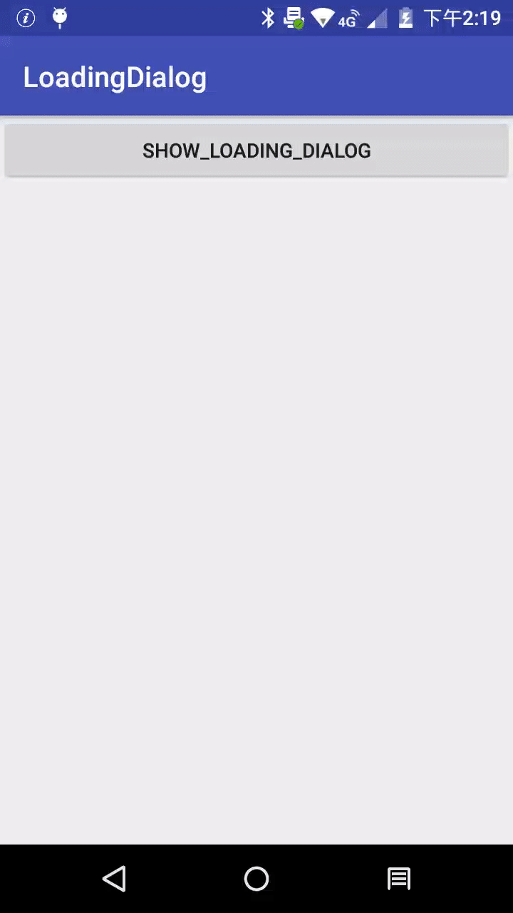

# LoadingDialog
一个图通用的 loading 对话框

## 效果展示



## 如何使用

```java 
//创建实例
LoadingDialog mDialog =LoadingDialog.newInstance()
						.setText("加载中")
						.setLoadingColor(ContextCompat.getColor(getApplicationContext(), R.color.colorPrimary));
						
//显示
mDialog.show(getSupportFragmentManager());
```


## 基础原理

使用 **DialogFragment **+ **ProgressBar** 实现


## 总结

| 方法                           | 功能         | 备注    |
| ------------------------------ | ------------ | ------- |
| setText(CharSequence sequence) | 设置显示文字 |         |
| setTextSize(int textSize)      | 设置文字大小 | 单位 sp |
| setTextColor(int color)        | 设置字体颜色 |         |
| setSize(int size)              | 设置界面大小 | unit dp |
| setLoadingColor(int color)     | 设置动画颜色 |         |


## 混淆


## 版本迭代

| 当前版本 | 更新内容 | 备注 |
| -------- | -------- | ---- |
| V1.0.0   | 初始版本 |      |


## 参考与致谢

- **[Android 封装一个通用 DialogFragment ](https://blog.csdn.net/qq_14876133/article/details/81012388)**

